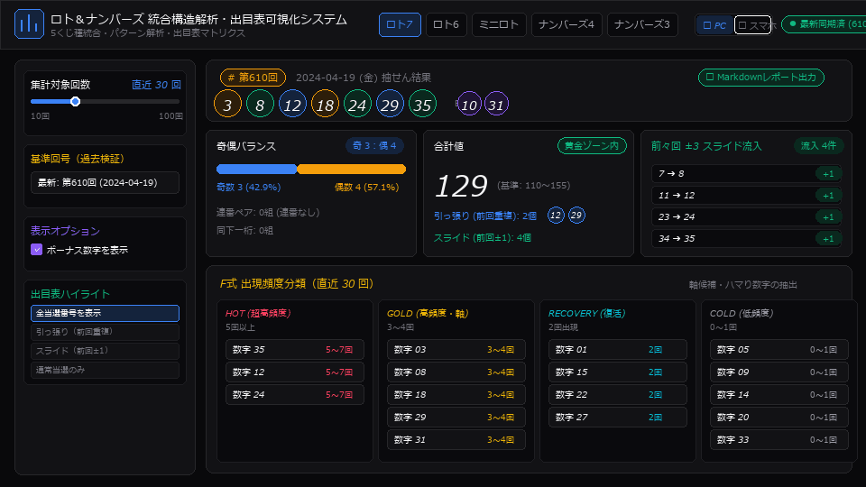

# ロト＆ナンバーズ 統合構造解析・可視化ツール

[](https://github.com/tk030-lotto/lotto-numbers-visualization-tool/actions/workflows/deploy.yml)

🌐 **公開URL (GitHub Pages)**: [https://tk030-lotto.github.io/lotto-numbers-visualization-tool/](https://tk030-lotto.github.io/lotto-numbers-visualization-tool/)



ロト（ロト7・ロト6・ミニロト）およびナンバーズ（ナンバーズ4・ナンバーズ3）の過去出目データを解析・可視化するWebアプリケーションです。  
※本ツールは買い目の自動生成・予想ではなく、過去出目データの純粋な構造解析・パターン分析・出目表可視化を目的としています。

---

## 主な機能

### 1. 構成解析
- **奇偶比**: 奇数と偶数の構成比率を集計。
- **合計値 & 判定**: 当選番号の合計値および黄金ゾーン（ロト）/ 期待値ゾーン（ナンバーズ）の適正判定。
- **数字帯分布**: 10区切り（1〜10、11〜20、21〜30、31〜）での出現分布。
- **末尾被り**: 下一桁の数字の重複有無を集計。
- **連番**: 連続する数字の組み合わせを検出。
- **引っ張り**: 前回抽選数字からの連続出現を検出。
- **スライド**: 前回抽選数字の ±1 の数字の出現を検出。
- **ナンバーズ型判定**: シングル / ダブル / トリプル / フォース のパターン分類。

### 2. 出現頻度分類
直近N回の当選データから全数字を4段階に分類：
- **HOT**: 5回以上出現（超高頻度）
- **GOLD**: 3〜4回出現（高頻度・軸候補）
- **RECOVERY**: 2回出現（復活傾向）
- **COLD**: 0〜1回出現（低頻度・ハマり）

### 3. スライド・マクロ分析 (川の流れ)
- 前々回の当選番号から周辺±3マス内に流入した数字を検出・可視化（ロト系）。

### 4. マクロトレンドグラフ
- 直近N回の合計値推移折れ線グラフ（Recharts）。
- 黄金ゾーン上下限ライン、ナンバーズ中央期待値ラインを表示。
- 各ポイントへのホバーによる回号・日付・当選番号・合計値ツールチップ表示。

### 5. 直近詳細メトリクス一覧表
- 直近N回の回号別指標（合計値、奇偶比、連番、引っ張り、スライド、型など）を整理したテーブル。

### 6. 出目表 (Occurrence Matrix) & 表示モード切替
- **ロト系**: 1〜37（ロト7） / 1〜43（ロト6） / 1〜31（ミニロト） × 回号。
- **ナンバーズ系**: 0〜9 × 回号（同一回の複数出現時は重複カウントバッジを表示）。
- **色分け表示**:
  - 🟨 通常当選（黄）
  - 🟦 引っ張り（青） — 前回出現
  - 🟩 スライド（緑） — 前回±1
- **表示モード切替**: 🖥️ PC表示（全列横スクロール） / 📱 スマホ表示（高密度コンパクトビュー、数字帯［1〜10、11〜20等］ゾーン絞り込み対応）のワンクリック切り替え。

### 7. 拡張分析機能
- **数字個別詳細パネル**: 出目表や頻度カードの数字をクリックした際に対象数字の未出現スパン、過去最大スパン、共起上位ペア、スライド流入実績を表示。
- **共起ペア相性分析**: 直近N回で同時に出現したペアの頻度ランキングを集計。
- **未出現スパン分析**: 各数字の現在の連続未出現回数および過去最大スパンを一覧表示。
- **ナンバーズ桁別ヒートマップ**: 百・十・一・千の位における各数字の出現分布を可視化。
- **出目表インタラクティブフィルター**: 引っ張り・スライド・奇数・偶数・数字帯のハイライトトグル。
- **基準回号選択（遡り検証）**: 過去の任意の回号を基準点として指定し、当時のデータで再計算・表示。
- **Markdownレポート出力**: 解析結果およびメトリクスをMarkdown形式でクリップボードに出力。

---

## 技術スタック

- **フロントエンド**: React 18 / TypeScript 5.6+ / Vite 5
- **スタイリング**: Vanilla CSS（プロジェクト統計ツール準拠のデザインシステムトークン）
- **グラフライブラリ**: Recharts
- **アイコン**: Lucide React
- **公開形式**: 静的SPA（GitHub Pages対応）

---

## 起動・開発手順

### 最も簡単な起動方法（Windows）
プロジェクト直下にある **`ツール起動.bat`** をダブルクリックしてください。
- 初回実行時は自動で `npm install` が実行されます。
- 開発サーバーが起動し、自動的にブラウザ（`http://localhost:3000/`）が開きます。

---

### 前提条件
- Node.js 18.0.0 以上
- npm 9.0.0 以上

### コマンドラインからの起動
```bash
# 依存関係のインストール（初回のみ）
npm install

# ローカル開発サーバー起動
npm run dev
```

### プロダクションビルド
```bash
npm run build
```

---

## データ取得仕様

- **データソース**: `https://tk030-lotto.github.io/lotto-data-hub/data/${gameKey}.json`
- **対象キー**: `loto7`, `loto6`, `miniloto`, `numbers4`, `numbers3`
- **動作**: 起動時およびくじ種切り替え時にバックグラウンドで最新JSONを自動非同期フェッチ。オフライン時は内蔵プリロードデータにフォールバック。

---

## 免責事項

- 本ツールは過去データの統計・構造解析および可視化を目的としており、将来の当選を保証するものではありません。
- 宝くじの購入は自己責任において行ってください。

---

## ライセンス

MIT License

Copyright (c) 2026 tk030-lotto

Permission is hereby granted, free of charge, to any person obtaining a copy
of this software and associated documentation files (the "Software"), to deal
in the Software without restriction, including without limitation the rights
to use, copy, modify, merge, publish, distribute, sublicense, and/or sell
copies of the Software, and to permit persons to whom the Software is
furnished to do so, subject to the following conditions:

The above copyright notice and this permission notice shall be included in all
copies or substantial portions of the Software.

THE SOFTWARE IS PROVIDED "AS IS", WITHOUT WARRANTY OF ANY KIND, EXPRESS OR
IMPLIED, INCLUDING BUT NOT LIMITED TO THE WARRANTIES OF MERCHANTABILITY,
FITNESS FOR A PARTICULAR PURPOSE AND NONINFRINGEMENT. IN NO EVENT SHALL THE
AUTHORS OR COPYRIGHT HOLDERS BE LIABLE FOR ANY CLAIM, DAMAGES OR OTHER
LIABILITY, WHETHER IN AN ACTION OF CONTRACT, TORT OR OTHERWISE, ARISING FROM,
OUT OF OR IN CONNECTION WITH THE SOFTWARE OR THE USE OR OTHER DEALINGS IN THE
SOFTWARE.
